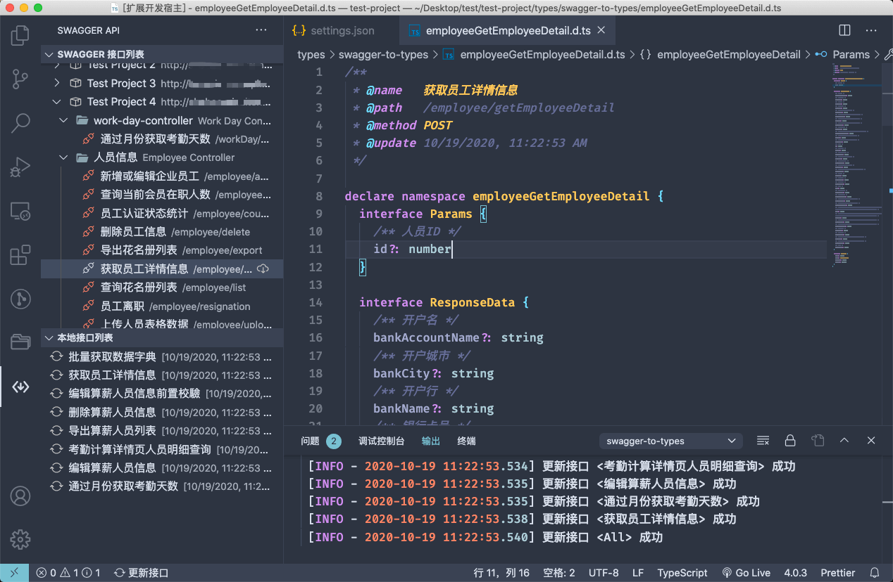

# swagger-to-types README

[中文说明](./README-zh-cn.md)

Export Swagger JSON to Typescript interface

Each interface generates a `namespace` (for grouping and avoiding duplicate names), including `Params`, `Response`, and each DTO can generate an independent `interface`.

## Preview



## Config

| Name | Description | Type | Default |
| --- | --- | --- | --- |
| swaggerToTypes.swaggerJsonUrl | Swagger API list | [SwaggerJsonUrlItem](#SwaggerJsonUrlItem)[] | [] |
| swaggerToTypes.swaggerJsonHeaders | Append request headers (global) | object | {} |
| swaggerToTypes.savePath | `.d.ts` interface file save path | string | 'types/swagger-interfaces' |
| swaggerToTypes.showStatusbarItem | Show status bar button | boolean | `true` |
| swaggerToTypes.compareChanges | Whether to compare changes when updating the interface (no change, no update) | boolean | `true` |
| swaggerToTypes.reloadWhenSettingsChanged | Reload data when user settings change. (Need to be turned off in some cases of frequent refresh settings) | boolean | `true` |

## SwaggerJsonUrlItem

| Attribute | Description | Type | Required |
| -------- | ---------------------------------- | ------ | -------- |
| title | Project title | string | \* |
| url | swagger json url | string | \* |
| link | Open external link in browser | string | |
| basePath | basePath | string | |
| headers | Custom request header information (such as authentication Token, etc.) | object | |

## Shortcut keys

- Search interface list: <kbd>alt</kbd> + <kbd>shift</kbd> + <kbd>F</kbd>

---

The following are optional configurations:

## Ignore one-click update

Add the `@ignore` tag to the header comment of the `.d.ts` file to ignore the current file when updating the local interface with one click.

```ts
/**
* @name Example interface
* @path /demo/demo-api
* @method POST
* @update 10/19/2020, 11:22:53 AM
* @ignore
*/
```

## Interface template

Used to customize the output content format in some special scenarios.

| Method name | Parameters | Return value |
| ------------ | ------------------------------------------ | ------------------ |
| namespace | TreeInterface | string |
| params | TreeInterface | string |
| paramsItem | TreeInterfacePropertiesItem, TreeInterface | string |
| response | TreeInterface | string |
| responseItem | TreeInterfacePropertiesItem, TreeInterface | string |
| copyRequest | FileHeaderInfo | string \| string[] |

For detailed types, refer to [TemplateBaseType](src/tools/get-templates.ts#L11)

#### Example: Add group prefix

Edit the `.vscode/swagger-to-types.template.cjs` file.

> ⚠️⚠️⚠️ Note: If the `package.json` of the project has the `"type": "module",` field, the template configuration file must have the `.cjs` suffix, otherwise the plugin will not work properly.

```js
function namespace(params) {
return `${params.groupName.replace(/[\-\n\s\/\\]/g, '_')}_${params.pathName}`
}

module.exports = { namespace }
```

#### Example: Convert field names to upper camel case

Edit `.vscode/swagger-to-types.template.js` file

```js
/**
* Capitalize the first letter
* @param {String} str
*/
function toUp(str) {
if (typeof str !== 'string') return ''
return str.slice(0, 1).toUpperCase() + str.slice(1)
}

function paramsItem(item, params) {
// Project title (swaggerToTypes.swaggerJsonUrl[number].title) is demo-1 Ignore custom solutions when 
if (params.groupName === 'demo-1') return

return `${toUp(item.name)}${item.required ? ':' : '?:'} ${item.type}`
}

module.exports = { paramsItem }
```

## Copy request function

Configure a request function template for quick copying

Edit the `.vscode/swagger-to-types.template.js` file

If the `copyRequest` function is exported, this function can be used

Related buttons will appear in the following locations:

- Local interface list operation button
- `.d.ts` file title bar operation button
- `.d.ts` file code line first text button

Here is an example:

```js
/**
* Request function template
*
* @param {{
* fileName: string
* ext: string
* filePath: string
* name?: string
* namespace?: string
* path?: string
* method?: string
* update?: string
* ignore?: boolean
* savePath?: string
* }} fileInfo
* @returns
*/
function copyRequest(fileInfo) {
return [
`/** ${fileInfo.name} */`,
`export async function unnamed(params?: ${fileInfo.namespace}.Params, options?: RequestOptions) {`,
` return $api`,
` .request<${fileInfo.namespace}.Response>('${fileInfo.path}', params, {`,
` method: ${fileInfo.method},`,
` ...options,`,
` })`,
` .then((res) => res.content || {})`,
`}`,
]
}

module.exports = {
// ...
copyRequest,
}
```

## Source code related

Development preview debugging: Press <kbd>F5</kbd> in vscode.

## Note

- Support swagger v2 API
- Support openapi 3.0.0 (new in 1.1.4)
- Please do not directly assign values to the parameters of the template processing function, which may have destructive effects.
